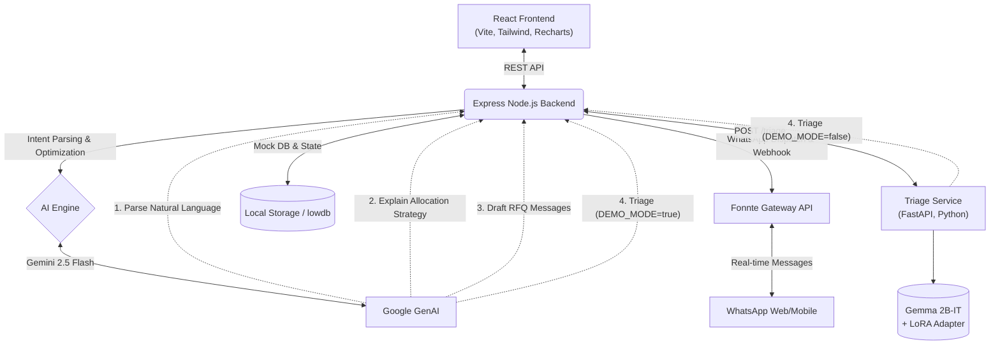

# Pasokin — Autonomous Procurement & Material Optimizer Agent

Pasokin is a smart B2B web application designed for manufacturing SMBs in Indonesia. It allows users to simply state their raw material requirements in natural language and instantly receive an AI-optimized, multi-supplier allocation that balances cost, speed, and reliability. Once approved by a human operator, the system acts as an autonomous agent, automatically dispatching WhatsApp RFQ messages to suppliers and triaging their live responses to highlight only the negotiations that need human intervention.

## 🏗 Architecture Overview



## 🤖 How AI is Used in Pasokin

Pasokin utilizes AI as a core architectural driver, moving beyond a simple chatbot interface to act as an autonomous agent with human-in-the-loop checkpoints:
1. **Intelligent Parsing**: We use LLMs with structured outputs to convert messy, free-text material requests (e.g., "Butuh baja ringan 50rb batang besok") into strict JSON parameters.
2. **Multi-Criteria Optimization Engine**: A deterministic greedy algorithm evaluates suppliers using min-max normalization against the user's explicit Cost/Speed/Risk weights, automatically splitting large volumes across multiple vendors to respect maximum capacity constraints and protect minimum order quantities (MOQ).
3. **Reasoning & Communication**: The LLM writes professional, personalized WhatsApp RFQ messages for each allocated supplier and explains its overall allocation strategy to the human operator in plain Bahasa Indonesia.
4. **Auto-Triage**: When suppliers reply via WhatsApp, the AI automatically reads their messages, compares them against the original requested terms, and extracts the final agreed price/qty/date. If the supplier haggles, the AI routes the conversation to a "Needs Manual Review" inbox; otherwise, it marks it "Confirmed" for immediate PO generation.

## 🚀 Setup & Run Instructions

### Prasyarat (Prerequisites)
- Docker & Docker Compose (Direkomendasikan untuk penjurian)
- Node.js (v18+) jika ingin menjalankan tanpa Docker
- Google Gemini API Key

### Instalasi & Menjalankan Aplikasi (Sesuai Ketentuan COMPFEST)

Sesuai dengan ketentuan penyisihan, sistem ini telah dikonfigurasi agar dapat dijalankan secara instan menggunakan `docker-compose`.

1. **Clone repository:**
   ```bash
   git clone <repo-url>
   cd Pasokin
   ```

2. **Konfigurasi Environment:**
   ```bash
   cd backend
   cp .env.example .env
   ```
   Buka `backend/.env` dan masukkan API Key Gemini Anda:
   ```env
   GEMINI_API_KEY="your-gemini-api-key"
   PORT=4000
   DEMO_MODE=true
   ```
   *Catatan: `DEMO_MODE=true` mensimulasikan koneksi WhatsApp dan memberikan delay artifisial yang mulus untuk presentasi live tanpa perlu pemindaian QR manual. Dalam mode ini, service `triage-service` juga otomatis melewati loading model Gemma 2B asli (yang gated dan butuh HuggingFace token) dan cukup idle, karena backend tidak memanggilnya sama sekali saat DEMO_MODE aktif.*

   *Jika ingin menjalankan triage service dengan model Gemma 2B + adapter yang sesungguhnya (`DEMO_MODE=false`), siapkan `HF_TOKEN` (HuggingFace access token dengan akses ke `google/gemma-2b-it`) di environment host sebelum `docker-compose up`, misalnya `HF_TOKEN=hf_xxx docker-compose up --build`.*

3. **Jalankan via Docker Compose:**
   Kembali ke root folder `Pasokin` dan jalankan perintah:
   ```bash
   docker-compose up --build
   ```
   - Frontend dapat diakses di: `http://localhost:5173`
   - Backend API berjalan di: `http://localhost:4000`

### Model Fine-Tuning (Kepatuhan Kompetisi)

Sesuai dengan syarat kompetisi *"Model wajib di fine tune sesuai dengan inovasi fitur per tim"*, kami telah menyiapkan dataset dan pipeline fine-tuning di dalam direktori `/model-tuning`. 

Dataset `dataset_triage.jsonl` berisi sampel sintetik untuk melatih model Gemini agar lebih akurat mengekstrak dan mengklasifikasikan balasan WhatsApp dari supplier (misal: supplier yang nego harga vs yang setuju 100%) menjadi format JSON terstruktur untuk ditampilkan di Inbox Triage. Script `tune.js` menangani interaksi dengan Google GenAI Tuning API. Pada environment pengembangan, aplikasi menggunakan teknik *In-Context Learning (Prompt Tuning)* pada `gemini-2.5-flash` untuk menjamin reprodusibilitas juri secara instan, namun arsitektur telah mendukung injeksi `GEMINI_TUNED_MODEL_ID` untuk production.


