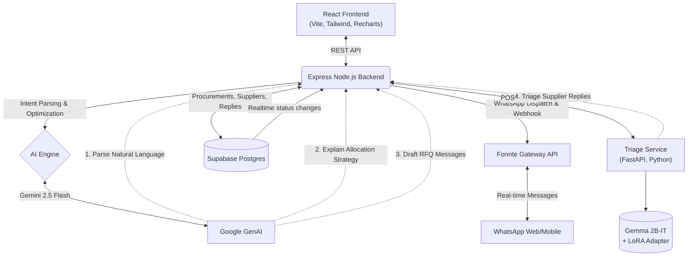

# Pasokin — Autonomous Procurement & Material Optimizer Agent

Pasokin is a smart B2B web application designed for manufacturing SMBs in Indonesia. It allows users to simply state their raw material requirements in natural language and instantly receive an AI-optimized, multi-supplier allocation that balances cost, speed, and reliability. Once approved by a human operator, the system acts as an autonomous agent, automatically dispatching WhatsApp RFQ messages to suppliers and triaging their live responses to highlight only the negotiations that need human intervention.

## 🏗 Architecture Overview


```mermaid
graph TD
    A["React Frontend\n(Vite, Tailwind, Recharts)"] <-->|REST API| B(Express Node.js Backend)

    B -->|Intent Parsing & Optimization| C{AI Engine}
    C <-->|Gemini 2.5 Flash| D[Google GenAI]

    B -->|WhatsApp Dispatch & Webhook| E[Fonnte Gateway API]
    E <-->|Real-time Messages| F[WhatsApp Web/Mobile]

    B <-->|Procurements, Suppliers, Replies| G[(Supabase Postgres)]
    G -->|Realtime status changes| B

    %% Triage Service - Gemma 2B + LoRA adapter
    B <-->|POST /triage| H["Triage Service\n(FastAPI, Python)"]
    H --> I[("Gemma 2B-IT\n+ LoRA Adapter")]

    %% AI Use Cases
    D -.->|1. Parse Natural Language| B
    D -.->|2. Explain Allocation Strategy| B
    D -.->|3. Draft RFQ Messages| B
    H -.->|4. Triage Supplier Replies| B
```

## 🤖 How AI is Used in Pasokin

Pasokin utilizes AI as a core architectural driver, moving beyond a simple chatbot interface to act as an autonomous agent with human-in-the-loop checkpoints:
1. **Intelligent Parsing**: We use LLMs with structured outputs to convert messy, free-text material requests (e.g., "Butuh baja ringan 50rb batang besok") into strict JSON parameters.
2. **Multi-Criteria Optimization Engine**: A deterministic greedy algorithm evaluates suppliers using min-max normalization against the user's explicit Cost/Speed/Risk weights, automatically splitting large volumes across multiple vendors to respect maximum capacity constraints and protect minimum order quantities (MOQ).
3. **Reasoning & Communication**: The LLM writes professional, personalized WhatsApp RFQ messages for each allocated supplier and explains its overall allocation strategy to the human operator in plain Bahasa Indonesia.
4. **Auto-Triage**: When suppliers reply via WhatsApp, the AI automatically reads their messages, compares them against the original requested terms, and extracts the final agreed price/qty/date. If the supplier haggles, the AI routes the conversation to a "Needs Manual Review" inbox; otherwise, it marks it "Confirmed" for immediate PO generation.

## 🚀 Setup & Run Instructions

### Prasyarat (Prerequisites)
- Docker Desktop dan Docker Compose (cara termudah untuk menjalankan seluruh stack)
- Google Gemini API Key untuk parsing kebutuhan dan reasoning optimasi
- Fonnte token hanya untuk WhatsApp live
- Hugging Face token hanya untuk menjalankan Gemma asli (`DEMO_MODE=false`)
- Proyek Supabase dengan akses SQL Editor dan service role key

### Instalasi & Menjalankan Aplikasi (Sesuai Ketentuan COMPFEST)

Sesuai dengan ketentuan penyisihan, sistem ini telah dikonfigurasi agar dapat dijalankan secara instan menggunakan `docker-compose`.

1. **Clone repository:**
   ```bash
   git clone <repo-url>
   cd Pasokin
   ```

2. **Konfigurasi Environment:**
   ```bash
   cp .env.example .env
   ```
   Buka `.env` di folder root dan isi API key bila fitur Gemini ingin digunakan:
   ```env
   GEMINI_API_KEY="your-gemini-api-key"
   HF_TOKEN="your-huggingface-token"
   FONNTE_TOKEN="your-fonnte-token"
   PORT=4000
   DEMO_MODE=false
   SUPABASE_URL="https://your-project-ref.supabase.co"
   SUPABASE_SERVICE_ROLE_KEY="your-backend-only-service-role-key"
   ```
   Pastikan akun Hugging Face sudah mendapat akses ke `google/gemma-2b-it` dan `HF_TOKEN` memiliki izin baca. Pastikan nomor WhatsApp juga sudah terhubung di dashboard Fonnte. Token Fonnte digunakan untuk mengirim pesan dan menerima balasan melalui webhook.

   `HF_TOKEN` harus memiliki akses ke model gated `google/gemma-2b-it`. Docker Compose akan meneruskan token tersebut ke `triage-service` saat container dijalankan.

   Untuk presentasi tanpa koneksi WhatsApp atau download model Gemma, gunakan `DEMO_MODE=true`. Mode ini mensimulasikan koneksi WhatsApp dan melewati loading model Gemma 2B.

   `SUPABASE_SERVICE_ROLE_KEY` hanya boleh ada di environment backend atau file `.env` lokal yang diabaikan Git. Jangan memasukkannya ke Vite, frontend, atau commit. Browser menerima pembaruan status melalui endpoint backend `/api/procurements/events`, sehingga anon key tidak diperlukan oleh frontend. Seluruh tabel memakai RLS dan akses anon dicabut.

   Form supplier publik tersedia di `/daftar-supplier`; Manajemen Supplier tetap berada di dashboard. NIB/NPWP diperiksa formatnya saja (NIB 13 digit, NPWP 15 atau 16 digit); badge Verified berarti self-declared, belum terhubung ke OSS. Skor reliability dimulai dari 0,5 dan hanya berubah lewat outcome transaksi. Nomor identitas serta rekening tidak dikirim kembali oleh endpoint publik supplier.

   Geocoding alamat memakai Google Geocoding API jika `GOOGLE_GEOCODING_API_KEY` disetel **hanya di backend**. Tanpa key atau jika pencarian gagal, supplier tetap dapat memilih pin pada peta dan mengisi koordinat manual. Peta memakai tile OpenStreetMap dengan atribusi. Lihat [dokumentasi Google Geocoding](https://developers.google.com/maps/documentation/geocoding/guides-v3/requests-geocoding) untuk menyiapkan key server.

   Detail legal dan rekening supplier hanya dibuka lewat endpoint admin dengan `PASOKIN_ADMIN_TOKEN` dari environment backend. Masukkan token tersebut di panel detail Manajemen Supplier; token tidak disimpan di browser. Tanpa token, endpoint publik hanya menampilkan data operasional. API dashboard lainnya masih memerlukan autentikasi/otorisasi menyeluruh sebelum produksi.

3. **Siapkan database:**
   Jalankan [`backend/supabase/schema.sql`](backend/supabase/schema.sql) di Supabase SQL Editor. Lalu impor data lama satu kali dari folder `backend`:
   ```bash
   npm install
   npm run seed
   ```
   Skrip seed membaca JSON lama hanya untuk migrasi dan aman dijalankan ulang; aplikasi tidak memakai file JSON sebagai penyimpanan runtime. Skema juga mengaktifkan Supabase Realtime untuk tabel `procurements`.

4. **Jalankan via Docker Compose:**
   Kembali ke root folder `Pasokin` dan jalankan perintah:
   ```bash
   docker compose up --build
   ```
   - Frontend dapat diakses di: `http://localhost:5173`
   - Backend API berjalan di: `http://localhost:4000`
   - Health check: `http://localhost:4000/api/health`

   Mode yang digunakan mengikuti nilai `DEMO_MODE` pada `.env`. Dengan `DEMO_MODE=false`, aplikasi menggunakan Fonnte untuk WhatsApp dan triage service Gemma. Atur webhook Fonnte ke `POST /api/wa/webhook` pada URL publik backend yang dapat diakses Fonnte, bukan `localhost`.

   Backend membaca dan menulis supplier, procurement, alokasi, balasan, riwayat RFQ, dan pengaturan dari Supabase. Jalankan `cd backend && npm test` untuk uji otomatis. Untuk produksi, tambahkan autentikasi dan otorisasi pengguna di backend sebelum membuka API ke publik; RLS saja tidak membatasi pemanggil endpoint Express yang belum memiliki login.

   Saat backend berjalan dengan `DEMO_MODE=true`, jalankan `node test/supabase-smoke.js` dan `node test/realtime-smoke.js` dari folder `backend` untuk menguji alur database dan stream status. Kedua skrip menghapus data uji yang mereka buat. Stream backend memakai Supabase Realtime dan pemeriksaan database berkala sebagai cadangan saat WebSocket tidak tersedia; koneksi stream panjang perlu hosting backend yang mendukung SSE.

### Proses Loading Model Triage

Saat `DEMO_MODE=false`, container `triage-service` melakukan langkah berikut ketika startup:
1. Mengunduh atau membaca tokenizer dan base model `google/gemma-2b-it` dari Hugging Face menggunakan `HF_TOKEN`.
2. Memuat model Gemma 2B ke CPU atau GPU yang tersedia.
3. Memasang adapter LoRA hasil fine-tuning dari folder `/app/adapter`.
4. Membuka endpoint `POST /triage` setelah model dan adapter selesai dimuat.

Loading pertama dapat memerlukan waktu dan ruang disk yang besar karena base model Gemma belum tersedia di cache container. Backend dapat mengembalikan status `503` selama proses loading berlangsung. Konfigurasi Docker saat ini menggunakan paket PyTorch CPU; pada mesin tanpa GPU, inference tetap berjalan tetapi respons triage dapat lebih lambat. Dukungan GPU memerlukan image dan runtime Docker yang dikonfigurasi khusus untuk CUDA.

Jika backend dijalankan di luar Docker dari folder `backend`, isi `TRIAGE_SERVICE_URL=http://localhost:8001` di `backend/.env`. Docker Compose mengatur alamat service ini secara otomatis ke `http://triage-service:8001`.

### Model Fine-Tuning (Kepatuhan Kompetisi)

Sesuai dengan syarat kompetisi *"Model wajib di fine tune sesuai dengan inovasi fitur per tim"*, kami telah menyiapkan dataset dan pipeline fine-tuning di dalam direktori `/model-tuning`. 

Dataset `dataset_triage.jsonl` digunakan untuk fine-tuning model triage Gemma 2B dengan adapter LoRA. Adapter hasil training disimpan di `/triage-service/adapter` dan dipakai oleh service FastAPI saat `DEMO_MODE=false`. Pada `DEMO_MODE=true`, service triage tidak memuat Gemma; backend memakai heuristik demo agar aplikasi dapat dijalankan tanpa download model besar.


